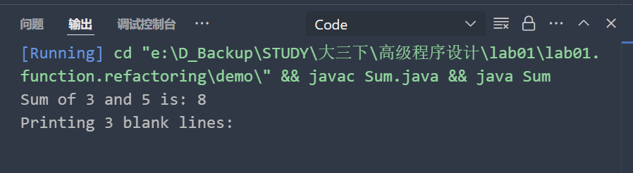

## 实验报告


- 课程名称 : **高级程序设计**
- 课程号 : **B01080**
- 实验项目 : **函数与重构**
- 专业班级 : **计算 xxxx**
- 学生学号 : **xxxxx**
- 学生姓名 : **xxxx**
- 所在学院 : **计算学院**
- 指导教师 : **郭鸣**

### 实验目的和要求

1. 熟悉函数调用与递归
2. 掌握代码重构的方法

### 实验内容和原理

#### 1. 阅读教材第 1 章，配置并熟悉 VS Code 与相关插件使用，学习调试 1.7.2 中代码

- 编译代码，查看运行结果

  
- 在调试器中查看函数 `sum` 的参数值
- 在代码 ` return c;` 添加断点，查看调用栈

```java
public class Sum {
    public static int sum(int a, int b) {
        int c = a + b;
        return c;
    }
    public static void main(String[] args) {
        int d = Sum.sum(1, 2);
        System.out.println(d);
    }
}
```

#### 2. 理解递归调用，调试 1.7.4 代码，理解图 1-6

- p32 如果调用过深，系统会抛出 StackOverflow 异常，请让该程序抛出异常
- 学习 demo 里面的代码，理解 stacksize 对递归调用的影响
- （附加）理解 demo 里面 chat.md 提到的尾递归的概念，自学尾递归优化的知识

```java
public static int factorial(int n){
    if(n==0){
        return 1;
    } else {
        return n * factorial(n - 1);
    }
}

public static void main(String[] args) {
    int ret = factorial(4);
    System.out.println(ret);
}
```

#### 3. 重构

- 学习 [ 网站 ][web] 重构部分内容
- 思考自己以前写的代码有哪些代码臭味
- 下面用了哪些重构办法

##### 重构前代码

```java
public static int[] generatePrimes(int maxValue) {
    if (maxValue < 2) {
        return new int[0];
    }
    boolean[] isCrossed = new boolean[maxValue + 1];
    for (int i = 2; i < isCrossed.length; i++) {
        isCrossed[i] = false;
    }
    int maxPrimeFactor = (int) Math.sqrt(isCrossed.length) + 1;
    for (int i = 2; i <= maxPrimeFactor; i++) {
        if (!isCrossed[i]) {
            for (int multiple = 2 * i; multiple < isCrossed.length; multiple += i) {
                isCrossed[multiple] = true;
            }
        }
    }
    int count = 0;
    for (int i = 2; i < isCrossed.length; i++) {
        if (!isCrossed[i]) {
            count++;
        }
    }
    int[] result = new int[count];
    for (int i = 2, j = 0; i < isCrossed.length; i++) {
        if (!isCrossed[i]) {
            result[j++] = i;
        }
    }
    return result;
}
```

##### 重构后代码

```java
public class PrimeGenerator {
    private static boolean[] isCrossed;
    private static int[] result;

    public static int[] generatePrimes(int maxValue) {
        if (maxValue < 2) {
            return new int[0];
        } else {
            initializeArrayOfIntegers(maxValue);
            crossOutMultiples();
            putUncrossedIntegersIntoResult();
            return result;
        }
    }

    private static void initializeArrayOfIntegers(int maxValue) {
        isCrossed = new boolean[maxValue + 1];
        for (int i = 2; i < isCrossed.length; i++) {
            isCrossed[i] = false;
        }
    }

    private static void crossOutMultiples() {
        int maxPrimeFactor = calcMaxPrimeFactor();
        for (int i = 2; i <= maxPrimeFactor; i++) {
            if (notCrossed(i)) {
                crossOutMultiplesOf(i);
            }
        }
    }

    private static int calcMaxPrimeFactor() {
        double maxPrimeFactor = Math.sqrt(isCrossed.length) + 1;
        return (int) maxPrimeFactor;
    }

    private static void crossOutMultiplesOf(int i) {
        for (int multiple = 2 * i; multiple < isCrossed.length; multiple += i) {
            isCrossed[multiple] = true;
        }
    }

    private static boolean notCrossed(int i) {
        return isCrossed[i] == false;
    }

    private static void putUncrossedIntegersIntoResult() {
        result = new int[numberOfUncrossedIntegers()];
        for (int i = 2, j = 0; i < isCrossed.length; i++) {
            if (notCrossed(i)) {
                result[j++] = i;
            }
        }
    }

    private static int numberOfUncrossedIntegers() {
        int count = 0;
        for (int i = 2; i < isCrossed.length; i++) {
            if (notCrossed(i)) {
                count++;
            }
        }
        return count;
    }
}
```

#### 4. refactoring.case 目录里面重构案例，选择一个，按文档完成代码重构过程。

### 提交方式

- 打包 zip 上传
- 实验报告采用 Markdown 格式
- zip 内容包括 Markdown 文本、代码、部分体现实验过程的典型截屏 (.png 格式 )

### 评阅

指导教师评语 :

实验报告评分（百分制）： 分

指导教师签名：

日 期： 2025 年 3 月 7 日

[web]: https://advprog25.pages.dev/
