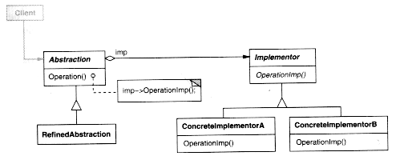
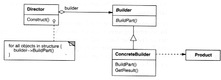
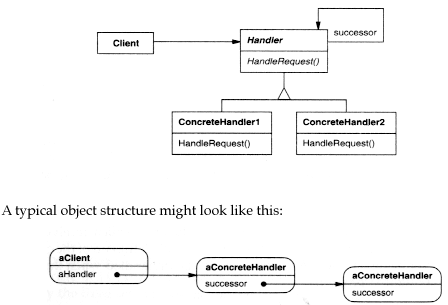
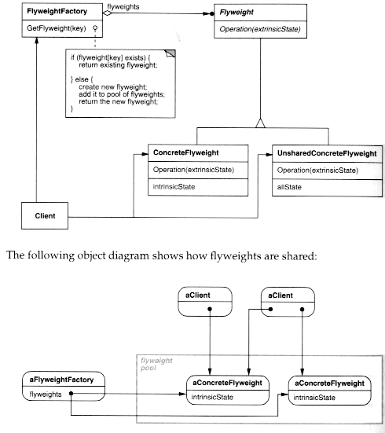
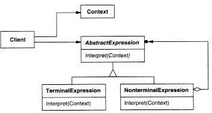
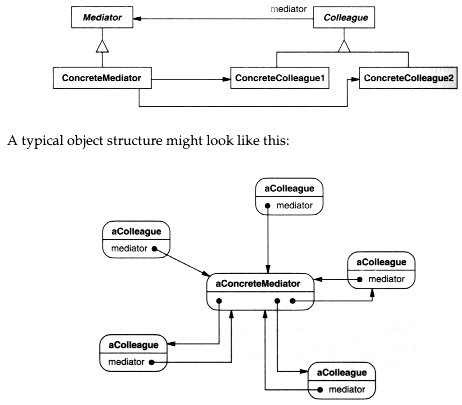
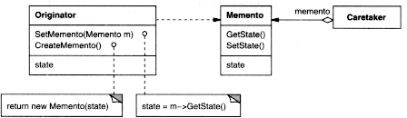
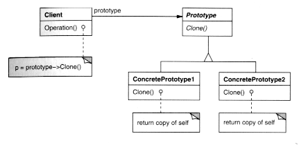
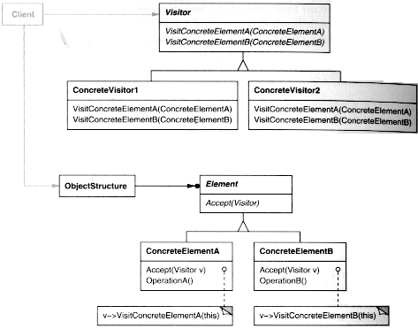

## DESIGN PATTERNS

### What Are Object-Oriented Design Patterns?

**Definition** A pattern of fixed class structure (think UML class sub-diagram) and messaging that repeatedly pops up as a particularly elegant and useful programming idiom.


- The original source for object-oriented design patterns: [Gamma et al. Design Patterns book](https://catalyst.library.jhu.edu/catalog/bib_5717838) (click on link for JHU access), circa 1995. The authors are known as the "Gang of Four" ("Go4" below).
- The [*Head First Design Patterns (HFDPs, pronounced "Heff Dupps")*](https://catalyst.library.jhu.edu/catalog/bib_5712813) (click for JHU access) textbook is a much better description/motivation of the patterns; we will use some of their examples below.
- The [Refactoring.guru design patterns pages](https://refactoring.guru/design-patterns/catalog) is a good on-line reference with additional examples.

Design patterns are important

- They are "advanced" / "clever" code structurings that you may not find on your own.
- They are needed often enough -- for the average OOSE project we see at least 3-4 patterns being helpful in the design.

Don't take the Gang of Four patterns as religion

- They are not hard and fast structures, each one is a theme you can apply variations to.
- There are other advanced design patterns beyond the ones we cover, but they tend to be more domain-specific. DO keep an eye out for them in your own coding.
- Beyond Object-Oriented design patterns there are also patterns of good design for how frameworks are interfaced to and composed, and for non-coding aspects of design in about any context (the design pattern idea originally came from the field of architecture).

### Separation of concerns and design patterns

- A primary focus of good design is our well-known friend,

   

  separation of concerns

  - In good code, every class / method should have a distinct focus of responsibility
  - Separate each different concern into a different class or method.

- Many design patterns have as their goal an improved separation of concerns.

Common low-level techniques in the design patterns that help with separation of concerns

- *Delegate* (forward) some messages to other objects
- Replace switch with inheritance and dynamic dispatch (we saw this in refactoring)
- *Reify* an action/method (a verb) as an object (a noun) to manipulate it in new ways.

## The Patterns

We are going to start with the patterns that focus more on separation of concerns since that is a major theme.

### Observer

[Refactoring.guru's Observer](https://refactoring.guru/design-patterns/observer)

**Go4 description:** Define a one-to-many dependency between objects so that when one object changes state, all its dependents are notified and updated automatically.

[**Diagram for Java's built-in Observer Class**](https://pl.cs.jhu.edu/oose/lectures/images/Observer-Java.PDF) - Java comes with a template to fill out if you want to use this pattern.


- This is a classic pattern pre-dating the Go4, when it was called "publish/subscribe" ("pub/sub"). The *publisher* is the object and the observers are its *subscribers*.
- The key advantage of observer is it *decouples* subjects and observers, they are only loosely acquainted. More *separation of concerns*.
- Subject can read/write its fields; Observer is a part that only needs to *read* the subject fields so can be decoupled into a separate class.
- Subject in particular does not need to concern itself with when and what particular fields the observer needs - the observer has a reference to the subject so can figure all that out on its own.
- Internally how it works: [see the code](https://pl.cs.jhu.edu/oose/lectures/images/Observer-Java-Code.PDF).
- Observer of some sort is found in nearly all GUI libraries
  - the model is the underlying logic (the weather data in the above)
  - various views register as observer so they can update when data changes
  - A particularly common method to use Observer in views is MVC, see below.

### Decorator

[Refactoring.guru's Decorator](https://refactoring.guru/design-patterns/decorator)

**Go4 description:** Attach additional responsibilities to an object dynamically. Decorators provide a flexible alternative to subclassing for extending functionality.
**[Generic diagram](https://pl.cs.jhu.edu/oose/lectures/images/Decorator.PDF)**

- [**Java IO Example**](https://pl.cs.jhu.edu/oose/lectures/images/Decorator-Java-IO.PDF) - Java IO makes excellent use of decorators
- [Here is a code example](https://pl.cs.jhu.edu/oose/lectures/images/Decorator-Java-Code.PDF) to make clear how the decorator "decorates"
- Notice in particular how the decorator method X calls the same method X on the "decoratee" and then does its thing with the result (or, does nothing extra); this is one of many examples of patterns using *delegation* for better separation of concerns.
- (Also note that the contract here requires calls to the superclass method as part of the contract; this is an instance of the [Call super](https://en.wikipedia.org/wiki/Call_super) anti-pattern but there is no nice alternative here.)

#### Design Principle: The Open-Closed Principle

This principle is illustrated well by the decorator pattern; we covered it in the [design principles](https://pl.cs.jhu.edu/oose/lectures/design-principles.shtml#ocp) lecture but will revisit it now.

- Decorator allows functionality to be added which are *extensions* which allowed the original codebase *to not change* the original code
- In particular notice how we are not inheriting to add functionality, the decorator is a new object forwarding messages to the decoratee
- I.e. the original code is "open to extension, closed to modification" -- OCP!

### Command

[Refactoring.guru's Command](https://refactoring.guru/design-patterns/command)

**Go4 description:** Encapsulate a request on an object, thereby letting one parameterise clients with different requests, queue or log requests, and support undoable operations.
[**Generic diagram**](https://pl.cs.jhu.edu/oose/lectures/images/Command.PDF)

- Command is for the case that there are many requests for some action which may themselves need to be controlled in some way (prioritize/delay/undo/etc).
- Book example: [remote control commands](https://pl.cs.jhu.edu/oose/lectures/images/CommandRemote.pdf) for a remote which can control lights, garage door, ceiling fan, etc.
- In this diagram,
  - `RemoteLoader` holds the set of commands,
  - the `LightOnCommand` (plus the not shown `FanOnCommand` etc etc etc) contains the code to perform the command via its `execute()` method, and
  - `Command` is an abstract superclass so we can generically support a multitude of concrete commands.
- Since these commands are now objects we can put them on a log queue, make macro commands (a `List` of commands can be a command), implement an `undo()` action, add `percentDone()` on long-running commands to gauge progress, etc.
- In addition, the command structure is more *decoupled* from the actual operations: the remote doesn't need to know about fans or lights.
- Command is an instance of the *reification* meta-pattern: turn an action/method (a verb) a class (a noun).

### Adapter

[Refactoring.guru's Adapter](https://refactoring.guru/design-patterns/adapter)

**Go4 description:** Convert the interface of a class into another interface clients expect. Adapter lets classes work together that couldn't otherwise because of incompatible interfaces.
[**Generic diagram**](https://pl.cs.jhu.edu/oose/lectures/images/Adapter.PDF)


- Adapter

   

  is needed when there is an interface, but it isn't quite what you need and either you can't change it or if you changed it to the way you wanted it would mess up something else.

  - It may have method names slightly different;
  - It may be missing one of the methods and so some default value must be popped in for that method
  - Some translation of the data may be needed, e.g. your interface expects rectangular coordinates for a point and the object you want to use expects polar coordinates.
  - You may want to add some extra functionality in the `Decorator` spirit, e.g. log requests.

- Then, the solution in the above case is to create a new intermediate object, the

   

  adapter

  , which serves to adapt the interface for that object.

  - and, the bad non-solution is not to make a new object solely reponsible for conversion but to inline the conversion code
  - This non-solution doesn't factor the responsibilities as much as Adapter can - *maximally* separate concerns/responsibilities
  - The new Adaptor object has one and only one responsibility: data conversion - focused responsibility is good!!

- The [book has an example](https://pl.cs.jhu.edu/oose/lectures/images/Adapter-Example.PDF) of how the old Java `Enumeration` class can be adapted to work like the new `Iterator` class.

### Façade

[Refactoring.guru's Facade](https://refactoring.guru/design-patterns/facade)

**Go4 description:** Provide a unified interface to a set of interfaces in a subsystem. Façade defines a higher-level interface that makes the subsystem easier to use.

- A facade turns a big bunch of objects into a *component*, by putting the interface of interaction with those objects on one object, the *façade*.

- The high-level interface abstracts away details that users of the objects don't need to be concerned with - yet another example of decoupling / separation of concerns

- Facade objects don't do significant work, they just delegate (forward messages) to other objects.

- Facades can also combine some adapting a la the Adapter pattern, such as supplying some of the arguments to lower-level methods, invoking multiple methods, etc.

- Example:

   

  Real-world home theater system example from book

  - [Before](https://pl.cs.jhu.edu/oose/lectures/images/Facade-Theater-Before.PDF): user needs to interact with all the individual components
  - [After:](https://pl.cs.jhu.edu/oose/lectures/images/Facade-Theater.PDF) the `HomeTheaterFacade` provides the complete interface to all the classes to outsiders, *including* regular ways to interact with them that may be a complex series of events.
  - [code examples](https://pl.cs.jhu.edu/oose/lectures/images/Facade-Theater-Code.PDF) of how methods on facade can do a lot more than just forward messages to the underlying object(s)
    — the methods on the facade are at a higher level of abstraction.

#### Design Principle: The Principle of Least Knowledge

> Talk only to your immediate friends

- Facade is a great pattern primarily because of how effectively it implements this principle.
- The "users" of the large collection of objects under the facade only need to talk to the facade object (their immediate friend) and not all of the other objects.
- This is also yet another instance of separation of concerns, the user can avoid having to understand the low-level details of the pieces.

#### Aside: Components

"Component" is a word that gets abused by computer scientists; its actually a fairly simple idea.

> A *component* is a "big object" -- it is a dynamic entity with an interface like an object (methods), but is more heavyweight: it may come with metadata, there may be multiple objects involved behind the scenes, it may be remote with an interface for networked interaction, etc.

**Examples**: façades, Microsoft COM objects, RESTful web services, plugin modules, etc.


### Factories

- Factories are methods creating objects rather than directly invoking `new`.

- Advantage of using interfaces or superclasses as abstractions breaks down when you `new`: it requires you to give the concrete class you are making, its impossible for `new` to be parametric.

- ... Factories to the rescue: they allow factory-calling code to create objects by invoking them instead of grubbing around with

   

  ```
  new
  ```

  .

  ```
  Window w = aWindowFactory.makeWindow()
  ```

  can return a say

   

  ```
  LightWindow
  ```

   

  or a

   

  ```
  DarkWindow
  ```

  , both of which are

   

  ```
  Window
  ```

  s, and the class with the above code need not be concerned with which it got back. Impossible to do with

   

  ```
  new
  ```

  .

A *Simple Factory* is any method that makes objects of more than one possible class. [Book example with pizzas.](https://pl.cs.jhu.edu/oose/lectures/images/Factory-Simple.PDF)

Simple factory is not considered an official design pattern, but is still very useful -- no need to stretch your simple factory into a complex one if its not needed.

There are two official design patterns, Factory Method and Abstract Factory, which can improve on using just a simple factory.

#### Factory Method

[Refactoring.guru's Factory Method](https://refactoring.guru/design-patterns/factory-method)

A factory method is a generalization of a simple factory:

- There is a superclass or interface which has the factory or method declared
- Subclasses or implementers specialize this factory to create the kinds of objects they need
- Advantage over simple factory above is no switch statement is needed when the factory decides what kind of object to make: the choice of subclass already made the decision.
  -- recall switch is a smell, and we are removing a switch

**Go4 description:** Define an interface for creating an object, but let subclasses decide which class to instantiate. Factory Method lets a class defer instantiation to subclasses.
[**Generic diagram**](https://pl.cs.jhu.edu/oose/lectures/images/Factory-Method.PDF)

- [Pizza example in HFDPs](https://pl.cs.jhu.edu/oose/lectures/images/Factory-Method-Pizza.PDF) and the [code for it](https://pl.cs.jhu.edu/oose/lectures/images/Factory-Method-Pizza-Code.PDF).

#### Design Principle: The Dependency Inversion Principle

"High level code should not depend directly on low level code; instead, both should depend on an abstractions"

- In other words, put an interface in the middle! Separate those concerns!
- We skipped this principle in the Design Principles lecture since Factory Method is a really good iillustration.
- The initial pizza-making code without a factory required the top-level `PizzaStore` class to itself choose the kind of pizza: [see picture from book](https://pl.cs.jhu.edu/oose/lectures/images/DIP-Bad.PDF).
- Arrows in the above (read as "dependent-on") show high-level code directly dependent on details of low-level code (it needs their names to create them via `new`)
- [This picture](https://pl.cs.jhu.edu/oose/lectures/images/DIP-Good.PDF) shows how the depenencies get inverted whan a factory method is used, meaning PizzaStore only deals with Pizza abstraction, not all the low-level details.
- The dependencies were inverted - D-I-P!

#### Abstract Factory

[Refactoring.guru's Abstract Factory](https://refactoring.guru/design-patterns/abstract-factory)

**Go4 description:** Provide an interface for creating families of related or dependent objects without specifying their concrete classes.
[**Generic diagram**](https://pl.cs.jhu.edu/oose/lectures/images/Abstract-Factory.PDF)

- [Abstract Factories for Pizzas](https://pl.cs.jhu.edu/oose/lectures/images/Factory-Abstract-Pizza.PDF) and some [Factory code](https://pl.cs.jhu.edu/oose/lectures/images/Factory-Abstract-Pizza-Code.PDF)
- The key difference here compared to Factory Method is the *FAMILY* of related classes getting created, and the factory is a separate *CLASS*.
- It probably doesn't deserve to be a design pattern, its just one of many variations possible on factories.

### Proxy

[Refactoring.guru's Proxy](https://refactoring.guru/design-patterns/proxy)

**Go4 description:** Provide a surrogate or placeholder for another object to control access to it.


- **Proxy** is a special case of delegation where nearly all methods of one object delegate to the same method in another object.
- [Virtual Proxy](https://pl.cs.jhu.edu/oose/lectures/images/ProxyVirtual.PDF): maybe actual object hasn't been created or loaded yet
  -- for example when browsing thumbnails you don't need the full Picture object, a PictureProxy in the middle may only have the thumbnail loaded and can itself load the Picture into memory if needed)
- Proxies can be used for access control: e.g. `ReadOnlyGoober` could be a proxy class for a `Goober` which does not forward setter messages to `Goober`, but forwards all others.
- Java RMI uses [remote proxies](https://pl.cs.jhu.edu/oose/lectures/images/ProxyRemote.PDF) for remote objects, and Hibernate uses proxies for database-stored objects.


### Template Method

[Refactoring.guru's Template Method](https://refactoring.guru/design-patterns/template-method)

**Go4 description:** Define the skeleton of an algorithm in an operation, deferring some steps to subclasses. Template Method lets subclasses redefine certain steps of an algorithm without changing the algorithm's structure.
[**Generic diagram**](https://pl.cs.jhu.edu/oose/lectures/images/Template-Method.PDF)

- Template method is needed if subclasses have methods that are similar (violating DRY) but also have different bits so it cannot be directly lifted to superclass.
- The template is an algorithm with code in the superclass but which has "holes" (steps not yet known at the superclass level) in it.
- The subclasses implement the "holes"
- The steps in the algorithm common to all implementations can be in the superclass (notice how this avoids code duplication)
- the subclasses provide the missing bits by instantiating some methods that were abstract in the superclass.
- [Example code](https://pl.cs.jhu.edu/oose/lectures/images/Template-Method-Example.PDF) for coffee or tea brewing; [diagram](https://pl.cs.jhu.edu/oose/lectures/images/Template-Method-Example-Diagram.PDF) of this example
- See also the [Form Template Method refactoring](https://refactoring.guru/form-template-method)

#### Design principle: the hollywood principle

> Don't call us, we'll call you

Translation:

- Context: a high-level component is talking to a low-level component.
- It is the high-level component that is in control of the process
- High-level component has a (general) interface for invoking low-level component
- Low-level component services the high-level component via the calls
- The reason to do this is to put some order to the madness: limit circular/tangled dependencies

Template method uses this pattern:

- The superclass with the template in it is the high-level component
- The subclasses are the low-level components
- The super is in control and calls the subclasses
- The subclasses *don't* call the super.

### Iterator

[Refactoring.guru's Iterator](https://refactoring.guru/design-patterns/iterator)

**Go4 description:** Provide a way to access the elements of an aggregate object sequentially without exposing its underlying representation.
[**Generic diagram**](https://pl.cs.jhu.edu/oose/lectures/images/Iterator.PDF)

- You know this one well: the Java collections all implement an [Iterator](http://docs.oracle.com/javase/8/docs/api/java/util/Iterator.html) interface.
- Key benefit: it hides the underling kind of collection since its irrelevant to users just iterating over it.
- Iterators need to hold the state of progress of one iteration through the object, so you make a new one of these guys for each iteration through the collection.
- The take-home message here is you can implement `Iterator` on your own classes which you may need to iterate through
  -- e.g. a `TreeIterator` which does a depth-first walk
  -- you can also add `jumpAheadTo()`, `reset()`, etc behavior needed for your domain, etc.

### Composite

[Refactoring.guru's Composite](https://refactoring.guru/design-patterns/composite)

**Go4 description:** Compose objects into tree structures to represent part-whole hierarchies. Composite lets clients treat individual objects and compositions of objects uniformly.
[**Generic diagram**](https://pl.cs.jhu.edu/oose/lectures/images/Composite.PDF)

- If you needed a recursive union type in C, use the composite pattern in an OO language -- Composite is important!

- HFDPS Example:

   

  restaurant menus with submenus

   

  and the

   

  solution

   

  using a Composite

  - The key advantage of this pattern is how `print()` can be implemented: an individual item just prints itself, and the composite prints all of its components.
  - Notice how the common superclass `MenuComponent` has all the methods of an individual `MenuItem` as well as of a composite `Menu`. This violates LSP (and because of that lots of `UnsupportedOperationException`s must be raised in e.g. `MenuItem`'s `add()` and `Menu`'s `isVegetarian`) but is needed for the useful uniformity.

- Java Swing UI example

   

  (also found in other nested window systems):

   

  `Component/Container`

  .

  - Swing implements a variation on Composite: `JComponent` is a subclass of `Container`, and so `JComponent` and all its subclasses (i.e., all swing widgets) are themselves containers.
  - `paint()` in a `JComponent` container first paints the component (`paintComponent()`) and then all of its children, if any (`paintChildren()`).

### State

[Refactoring.guru's State](https://refactoring.guru/design-patterns/state)

**Go4 description:** Allow an object to alter its behaviour when its internal state changes. The object will appear to change its class.
[**Generic diagram**](https://pl.cs.jhu.edu/oose/lectures/images/State.pdf)

- Book example is a gumball machine
  - The actions of inserting a coin, turning crank, etc vary depending on the state of the machine (coin previously inserted etc)
    (aside: behind every state pattern is a finite-state automaton)
  - The [smelly way to do it](https://pl.cs.jhu.edu/oose/lectures/images/StateExampleBad.PDF) -- a bunch of `switch` or `if-then-else` statements.
  - better way to do it: [with the state pattern](https://pl.cs.jhu.edu/oose/lectures/images/StateExampleGood.PDF)! [here is the main class code](https://pl.cs.jhu.edu/oose/lectures/images/StateExampleGoodCode.PDF) and [here are some state classes](https://pl.cs.jhu.edu/oose/lectures/images/StateExampleGoodCode2.PDF).
  - This is an example of the Replace Type Code with State/Strategy refactoring
  - Observe the delegation here, the state-dependent methods now are forwarded to the `State`-ful object.
- Another Example: in Fowler *Refactoring* Chapter 1, the state pattern was used for movies because their classification could dynamically change (a new class `Price` was introduced which is the `State` above, and it had subclasses `RegularPrice`, etc; `Movie` is the `Context` above, holding the `Price` state: [See this Figure](https://pl.cs.jhu.edu/oose/lectures/images/MoviePriceRefactored.PDF)).
- **State** is great: the underlying states of the design now have clear reifications as class names.

### Strategy

[Refactoring.guru's Strategy](https://refactoring.guru/design-patterns/strategy)

**Go4 description:** Define a family of algorithms, encapsulate each one, and make them interchangeable. Strategy lets the algorithm vary independently from clients that use it.

- This is very similar to **State**, it supports dynamic changing of some aspects of a class--in this case an algorithm.
- The class diagram is identical as well.

### Singleton

[Refactoring.guru's Singleton](https://refactoring.guru/design-patterns/singleton)

**Go4 description:** Ensure a class has only one instance and provide a global point of access to it.
[**Generic diagram**](https://pl.cs.jhu.edu/oose/lectures/PatternDiagrams/pattern-singleton.gif)

- For a class with only one member, something quite common in practice.
- Code it so that multiple instances *can't* be created.
- Have a class method to get the sole instance. [Java version (from Bloch's book)](https://pl.cs.jhu.edu/oose/lectures/images/EJ2-Singleton.PDF).

**Question:** why not just use static methods and create no instances?
**Answer:**

- Static methods are directly globally visible, violating encapsulation boundaries.
- You can't pass classes as arguments, but you *can* pass objects (note some languages do allow classes to be passed)
- There is no object polymorphism with classes - `ClockFace f` where `ClockFace` is an interface means `f` at run-time could be e.g. a `DigitalClockFace` or `AnalogClockFace` object
- This will not be extensible if for some reason two (or more) are needed.

## Architectural patterns


- Architectural patterns are patterns of system architecture, used by frameworks
- They are at a larger scale than design patterns and may not be involving objects alone

### Model - View - Controller (MVC)

This is a classic architectural pattern encouraging separation of concerns.

- MVC means factor out the front-end View (output) and the Controller (input) into separate components (often classes).
- Whats left is the *Model*, the code only doing the actual underlying logic of the app.
- Originally applied to GUI apps, e.g. Smalltalk UI's, Java Swing and JavaFX, Android Activities.
- More recently extended to web-based apps with some (or a lot of) abuse of the original terminology.

Picture from Wikipedia:


#### MVC and Observer

- Views can register as Observers of model, ready to update on any change to underlying model
- Multiple views can be observing the same model - fits nicely into Observer pattern
- Controller is also an observer of the global event queue

### MVC and modern web architectures

Web (and other RESTful) apps have a related architecture pattern, usually called a *three-tier architecture*

- V and C is top tier, model is middle, and at bottom is the persistence layer, the connection to the database.
- Example from the Todo app:
  - `Todo` is the model (its very simple; for e.g. your Lights out game you should have had several core classes for the underlying game such as `Board`, etc.);
  - `TodoController` is the controller which is the interface for receiving inputs;
  - The view is all on the front-end so there is no view in the Java code;
  - `TodoService` implements all the persistence operations - don't mix this into model or controller.

### MVC and the Active record pattern in Rails and Django

Rails claims to have an MVC architecture but its different in several ways from the classic one.

- (Rails is the RESTful server technology stack for Ruby; Django is similar)

- Model objects persisted in the database by the framework (via the

   

  [active record architecture pattern](https://en.wikipedia.org/wiki/Active_record_pattern)

  )

  - model objects can e.g. `save()` themselves to the database, framework does it all -- *automatic* Object-relational mapping (ORM)
  - To Do app is manually mapping objects to database -- *manual* ORM.

View (html) is just an html template, its not really an active object getting data from model, etc.

View should only *read* from the model; it will invoke controller (RESTful) actions to write.

##### [MVVM](https://en.wikipedia.org/wiki/Model–view–viewmodel) (Model - View - ViewModel)

- This is a modern variation on MVC which exists in the front-end of some web frameworks (e.g. Angular 1)
- The `ViewModel` is an adapter (see below) - it is converting data in the model into a form the view can digest it.

### Component-based Architecture (Angular 2 and React)

- This is a relatively novel architectural pattern for front-end development; see e.g. [this tutorial](https://medium.com/@dan.shapiro1210/understanding-component-based-architecture-3ff48ec0c238)
- Rather than designing a monolithic view for a whole page, views can be composed of multuple component views which the framework automatically stitches together
- In each component you can also separate out the html, css, and js just for that component, which the framework will also compose for you to give the html/css/js for the whole page view.
- The net effect is you have more "objects" of these html/css/js which can compose like normal objects do.

## More Gang of Four Patterns

The patterns from here on down are relatively infrequiently used and we are not going to cover them or ask you to learn them. They are summarized in Chaper 14 of the HFDPs book.

### Bridge

HFDPs p.612

**Go4 description:** Decouple an abstraction from its implementation so that the two can vary independently.
**Go4 Diagram:**



**Bridge** is an apt name, because it forms a bridge between two inheritance heirarchies.

**Bridge** emerges as a result of a refactoring which introduces delegation:

- Suppose you have a complex inheritance tree (example: `Window` with subclasses `IconWindow`, `Dialog`, etc)
- Suppose there are also different modalities of implementation of the whole tree, for example PC, UNIX, and Mac-specialized implementations are needed.
- Refactor this mess into two trees, an *abstraction* hierarchy which is the original `Window`/`IconWindow`/`Dialog` tree with the PC/Mac/UNIX implementation bits removed, and an implementation tree which has an abstract `Implementation` class and each concrete `ImplementationMac`, `ImplementationPC`, `ImplementationUNIX` as subclasses.
- The abstract tree then delegates to its implementation object for the low-level code.

### Builder

HFDPs p.614

**Go4 description:** Separate the construction of a complex object from its representation so that the same construction process can create different representations.
**Go4 Diagram:**



- the `Director` needs to create many different kinds of parts to make the full product. In the stupid method, the director has a whole pile of different classes he has to `new`.
- In the smart method above, he has a uniform pile (an `Array` say) of `Builder`'s, and by invoking `BuildPart()` on each one in a loop, he gets all his parts made with minimal code fuss.
- the `ConcreteBuilder` is a particular concrete `Builder`, a factory class, designed to create `Product`'s.

### Chain of Responsibility

HFDPs p.616

**Go4 description:** Avoid coupling the sender of a request to its receiver by giving more than one object a chance to handle a request. Chain the receiving objects and pass the request along the chain until an object handles it.
**Go4 Diagram:**



- This pattern shares some structural similarities with Java exceptions: either they are handled or passed on. But with exceptions they are implicitly passed on if they are not handled; here the passing on is explicit
- This pattern is useful for hierarchical structures where a request can be handled at multiple layers.
- Example: GUI event handling can be done hierarchically. If a contained view doesn't want to handle an event it can delegate it to its container, etc up the chain to the window. Java doesn't use this event model however.

### Flyweight

HFDPs p.618

**Go4 description:** Use sharing to support large numbers of fine-grained objects efficiently.
**Go4 Diagram:**



- This is a more specialized pattern, not used as often as the others.
- **Example:** Suppose a card game required 50 decks of cards. Only one set of actual cards need be created and shared

### Interpreter

HFDPs p. 620

**Go4 description:** Given a language, define a representation for its grammar along with an interpreter that uses the representation to interpret sentences in the language.
**Go4 Diagram:**



- This is a very specific pattern to represent language syntax.
- It is a variation on `Composite`. In general it is also like `Composite` showing how `union` types are encoded via this recursive diagram structure.

### Mediator

HFDPs p. 622 Put someone in charge (a *mediator*) of an interaction between two classes.

**Go4 description:** Define an object that encapsulates how a set of objects interact. Mediator promotes loose coupling by keeping objects from referring to each other explicitly, and it lets one vary their interaction independently.
**Go4 Diagram:**



### Memento

HFDPs p. 624

**Go4 description:** Without violating encapsulation, capture and externalise an object's internal state so that the object can be restored to this state later.
**Go4 Diagram:**



- This pattern can be one useful way to interact with a database in an object-oriented fashion: keep mementos around of all objects

### Prototype

HFDPs p. 626

**Go4 description:** Specify the kinds of objects to create using a prototypic instance and create new objects by copying this prototype.
**Go4 Diagram:**



- When you want new objects, *copy* from a prototype instead of creating directly from a class.
- Useful when its a significant effort to create object structure from scratch.
- **Example:** To create a new `Deck` of 52 playing cards, cards could be copied from a static variable in `Deck` which was originally initialized when the class was loaded to hold a "fresh" `Deck` of `Card` objects rather than making cards all over again.

### Visitor

HFDPs p. 628; also see [Bob Tarr's slides](http://userpages.umbc.edu/~tarr/dp/spr06/cs446.html)

**Go4 description:** Represent an operation to be performed on the elements of an object structure. Visitor allows one to define a new operation without changing the classes of the elements on which it operates.
**Go4 Diagram:**



- Suppose you have an `Element` object in a variable and need to perform a `switch` on what concrete subclass of `Element` we in fact have.

- Note that this is an *incredibly* common C programming pattern on `union` types -- you are casing on which branch of the union you are in (the C analogy of inheritence is union).

- The problem is this notion does not fit well with O-O, the union is treated as *passive* in this switch; you are also casing at run-time on what class an object is, a brittle programming pattern.

- Alternative 1: add a method to each class in the union to do the walkthrough

  - Big Advantage: we kept things highly O-O!
  - Big Disadvantage: this is shotgun surgery -- each time we want to do such a switch we have to add a method to all the classes in the tree. Code gets all spread out.

- Alternative 2:

   

  Visitor

  - Add an intermediary class, the *visitor*, which holds all the cases
  - The classes in the original inheritance hierarchy gets a new method `Accept` to help "walk" the visitor through the union
  - ... this is a compromise, we are not completely violating O-O and we avoid shotgun surgery when adding an operation over the tree, but it adds complexity to the design.
  - Note that if we add a new concrete element type we on the other hand have to do surgery on all visitors. But, we have localized the surgery to just the visitors.

- This pattern is another pattern that is useful to get rid of switch statements.

How the **Visitor** works:

- Abstract superclass *`Visitor`* is the superclass of all visitors
- `ConcreteVisitor1` is a concrete visitor (e.g. we make a class `GetHealthRating`for `getHealthRating()` in the menu example); we make new `ConcreteVisitorX` for each different switch we wanted to do over the union.
- `ConcreteVisitor1` has a method `visitConcreteElementA` etc for each kind of node A/B/.. in the original union structure - this is where the code in the original switch for the case it is `A`/`B`.. goes.
- `anElement.accept(aVisitor)` starts the visiting process
- This method in each inheritence class `ConcreteElementA` etc in turn calls the correct "case" to be performed on it, e.g. `ConcreteElementA` calls `visitConcreteElementA(this)` which will run the correct case of the switch..

The place where **Visitor** really shines is using it together with **Composite** to visit a tree structure.